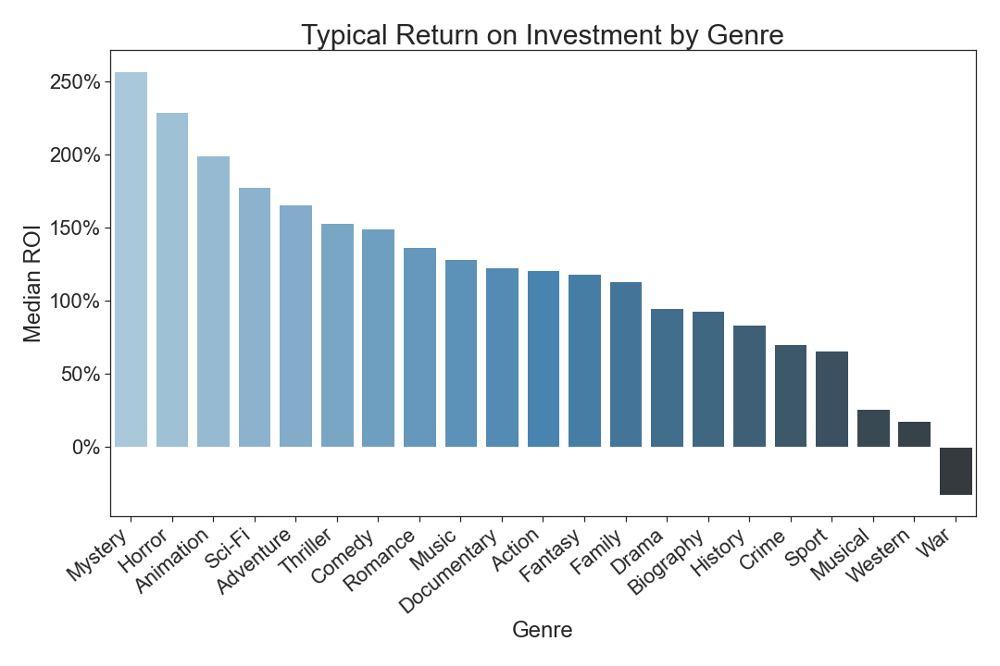

# Team Venus' Movie Analysis

**Authors**: 

- [Andrew Witman](https://github.com/andrewwhitman)
- [Matthew Turner](https://github.com/austint1121)
- [Wayne Harrison](https://github.com/wharr1203)


## Overview

The goal of this project is to provide actionable insights to the head of Microsoft's new fictional movie studio. We
used data from Box Office Mojo, IMDB, Rotten Tomatoes, TheMovieDB, and The Numbers. After analyzing the data the group
decided to recommend a genre of movie to make, which month to release the movie in, and how long the movie should be.
The results of our analysis found that the safest genre of movie to make would be an Animated film. We found that animated movies 
released during the summer would typically have a higher return on investment then any other month. Finally, we found
animated movies typically had the highest return on investment when they were 100 minutes long.
Therefore, we recommended that:

1. Microsoft makes animated movies
2. The studio should release movies during the summer months
3. The studio should aim to make movies approx. 100 minutes long.
***
## Business Problem

Our group was presented the fictional scenario:

Microsoft sees all the big companies creating original video content, and they want to get in on the fun. They have
decided to create a new movie studio, but they don't know anything about creating movies. You are charged with exploring
what types of films are currently doing the best at the box office. You must then translate those findings into
actionable insights that the head of Microsoft's new movie studio can use to help decide what type of films to create.

***

## Data
There are 11 CSV files comprising the dataset. After exploring the datasets, we chose to use 3 of them for our
to help guide our recommendations.

IMDb is an online database  containing information related to films, tv shows, video games, and the like. We used 
this dataset for information about a movie's genre, and runtime. We also used this dataset for information on how IMDB's
user's rated movies

The Movie DB is a user editable database for movies and TV shows. We used this dataset to determine when a movie was
released.

The Numbers is a website used as a source for movie financial data. We used this data to find metrics on a movie's profit,
budget, gross revenue, profit margin, and return on investment.

***

## Methods

Describe the process for analyzing or modeling the data. For Phase 1, this will be descriptive analysis.

***
Questions to consider:
* How did you prepare, analyze or model the data?
* Why is this approach appropriate given the data and the business problem?
***

## Results

### Genre
Most importantly, in the worst case scenario animation films are the only genre that has a positive ROI.
This is a new studio, they won't be expecting to make a perfect movie on their first project. They will be looking to
play it safe, to justify their creation, and to justify future funding. Therefore because animated films do reasonably well across all scenarios the safest choice would to be an animated film.

### Release Month
Based on these 3 findings would be to release the bulk of your movies during summer.
With a new studio, you would want to justify your profits right away, so it would be wise to follow the release date trend.¶

### Runtime
The 90th, 50th, and 10th percentile outcome for an animation with a runtime of 100 minutes is superior to its peers.
Typically, a 100-minute animation increases the number of votes by 548%, or 6.48x.

***


### Typical Return on Investment by Genre


## Conclusions

1. Microsoft should make an animated movie since it is the safest choice in regard to return on investment.


2. The studio should release the movie during the summer months since movies released during those months typically
have a higher return on investment  
  

3. The studio should aim to make the movie approx. 100 minutes long since movies longer/shorter generally have a worse
return on investment.

***

## Information

Please review our full analysis in [our Jupyter Notebook](./Movie_Analysis.ipynb) or our [presentation](./presentation.pdf).

## Repository Structure

```
├── Data                                <- Directory containing both cleaned and raw data
│   ├── zippedData                      <- Compressed, unmodified data from our sources 
│   │   └── ...
│   ├── imdb_data                       <- Cleaned data from IMDB
│   ├── tmdb_data                       <- Cleaned data from TheMovieDB
│   └── tn_data                         <- Cleaned data from The Numbers
├── Images                              <- Folder containing graphs from notebook and presentation
│   └── ...
├── DS_Project_Presentation.pdf         <- PDF version of project presentation
├── Movie_Analysis.ipynb                <- Narrative documentation of analysis in Jupyter notebook
└── README.md                           <- The top-level README for reviewers of this project
              

``` 